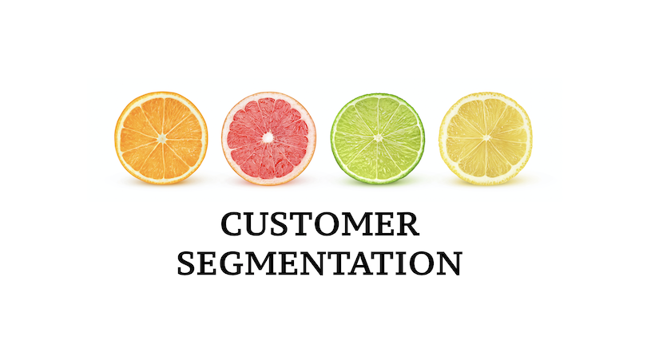

## About Me

Hands on AWS Architect, Full Stack Developer, Data Scientist/Engineer with over 15 years of experience in analysis, design, development, testing and deployment of software applications across different domains – Banking, Credit Cards, Insurance, Healthcare, Retail etc.

## Portfolio

---

### Data Science 

[Review Prediction and Sentimental Analysis](https://github.com/abhigyanmisra/dsc680/blob/master/Project1){:target="_blank"}
 
[Project Proposal](https://github.com/abhigyanmisra/dsc680/blob/master/Project1/Proposal%20-%20Review%20Prediction%20and%20Sentimental%20Analysis.docx){:target="_blank"}|[Code](https://github.com/abhigyanmisra/dsc680/blob/master/Project1/ReviewPredictionNSentimentalAnalysis.ipynb){:target="_blank"}
 

---
[Share Price Prediction](/pdf/sample_presentation.pdf){:target="_blank"}
 

---
[Customer Segmentation](http://example.com/){:target="_blank"}
 

---
### Other Data Science Projects

- [2019 Indian General Elections Analysis](https://github.com/abhigyanmisra/dsc680/tree/master/IndianElectionsAnalysis){:target="_blank"}
 [Code](https://github.com/abhigyanmisra/dsc680/blob/master/IndianElectionsAnalysis/IndianElectionAnalysis.ipynb){:target="_blank"}
- [Prediction of Mortality Risk for Cardio Vascular Patients: Using Python](https://github.com/abhigyanmisra/dsc680/tree/master/MortalityPredictionUsingPython){:target="_blank"} [Code](https://github.com/abhigyanmisra/dsc680/blob/master/MortalityPredictionUsingPython/MortalityPredictionUsingPython.ipynb){:target="_blank"}
- [Prediction of Mortality Risk for Cardio Vascular Patients: Using R](https://github.com/abhigyanmisra/dsc680/tree/master/MortalityPredictionUsingR){:target="_blank"} [Code](https://github.com/abhigyanmisra/dsc680/blob/master/MortalityPredictionUsingR/MortalityPredictionUsingR.Rmd){:target="_blank"}
- [Predicting Readmission of Diabetic Patients](https://github.com/abhigyanmisra/dsc680/tree/master/DiabeticReadmission){:target="_blank"} [Code](https://github.com/abhigyanmisra/dsc680/blob/master/DiabeticReadmission/DiabeticReadmission.ipynb){:target="_blank"}

### Data Visualization - Dashboards - Using Power BI
- [Dashboard 1 - Airline Safety](https://github.com/abhigyanmisra/dsc680/blob/master/Dashboards/Airline){:target="_blank"}
   [Code](https://github.com/abhigyanmisra/dsc680/blob/master/Dashboards/Airline/DSC640ProjectDashboard.pbix){:target="_blank"}|[PDF](https://github.com/abhigyanmisra/dsc680/blob/master/Dashboards/Airline/DSC640ProjectDashboard.pdf){:target="_blank"}
- [Dashboard 2 - Sales Revenue & Profits](https://github.com/abhigyanmisra/dsc680/blob/master/Dashboards/SalesNRevenue){:target="_blank"}
   [Code](https://github.com/abhigyanmisra/dsc680/blob/master/Dashboards/SalesNRevenue/Milestone1-Dashboard-Repeat.pbix){:target="_blank"}|[PDF](https://github.com/abhigyanmisra/dsc680/blob/master/Dashboards/SalesNRevenue/Milestone1-Dashboard-Repeat.pdf){:target="_blank"}
- [Dashboard 3 - CO2 Emissions & Rising Temperatures](https://github.com/abhigyanmisra/dsc680/blob/master/Dashboards/Environment){:target="_blank"}
   [Code](https://github.com/abhigyanmisra/dsc680/blob/master/Dashboards/Environment/Milestone1-Environment-Dashboard.pbix){:target="_blank"}|[PDF](https://github.com/abhigyanmisra/dsc680/blob/master/Dashboards/Environment/Milestone1-Environment-Dashboard.pdf){:target="_blank"}

---

### AWS, Microservices, Rules Engines
- [Rest API Gateway with Zuul](https://github.com/abhigyanmisra/api-gateway-sample){:target="_blank"}
- [Simple Spring boot Microservice](https://github.com/abhigyanmisra/simple-springboot-app){:target="_blank"}

---

